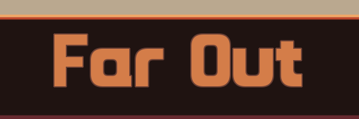
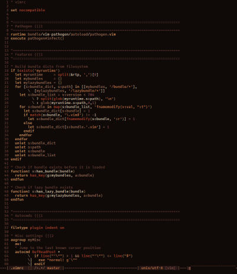
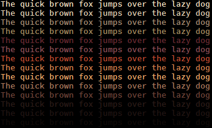

FarOut colorscheme for Vim:

- Base16 theme for gvim and terminals supporting 24-bit colors
- Simple, clean code created with [vim-rng](https://gist.github.com/5cd2f4ec222805f49eca.git)
- Airline, Lightline & CtrlP support out-of-the-box
- That theme is so far out, can you dig it man?

Screenshots
------------
Taken on minTTY with Office Code Pro font:

[](img/farout_vim.png)


Palette
--------


|  Hex  |
|-------|
|#F2DDBC|
|#E0CCAE|
|#a4896f|
|#A4895C|
|#66292F|
|#8A4B53|
|#BF472C|
|#D47D49|
|#F2A766|
|#A67458|
|#6B4035|
|#291916|
|#1F1311|
|#0F0908|

Installation
-------------
1. Install the bundle:
  *  [Pathogen][1] - `git clone https://github.com/fcpg/vim-farout ~/.vim/bundle/vim-farout`
  *  [NeoBundle][2] - `NeoBundle 'fcpg/vim-farout'`
  *  [Vundle][3] - `Plugin 'fcpg/vim-farout'`
  *  manual - copy all files into your `~/.vim` directory
2. Append the following line to your .vimrc file:
```VimL
colorscheme farout
```

FAQ
----
- How do I customize colors?  
  *  Either edit the 'colors/farout.vim' file (it's plain vim 'highlight' commands), if you don't mind merging when pulling/updating;
  *  Or override with autocommands in you .vimrc:
```VimL
augroup myBetterColors
  au!
  autocmd ColorScheme *  hi Number guifg=#707070
augroup END
```
- Some weird chars show up in my status line!  
  Check vim help for 'fillchars': `:h 'fcs`. The lightline theme use the 'stl'
  char in 'fillchars' if it is defined; unset it in your .vimrc to turn on the 
  "solid" status line.

Resources
----------
- Included in this repo ('misc' subdir):
  - Shell script for terminal settings (generic OSC commands)
  - .Xresources
  - .minttyrc
  - .dir_colors

Other Themes
-------------
- [Fahrenheit](https://github.com/fcpg/vim-fahrenheit)
- [Orbital](https://github.com/fcpg/vim-orbital)

License
--------
[Attribution-ShareAlike 4.0 Int.](https://creativecommons.org/licenses/by-sa/4.0/)

[1]: https://github.com/tpope/vim-pathogen
[2]: https://github.com/Shougo/neobundle.vim
[3]: https://github.com/gmarik/vundle
